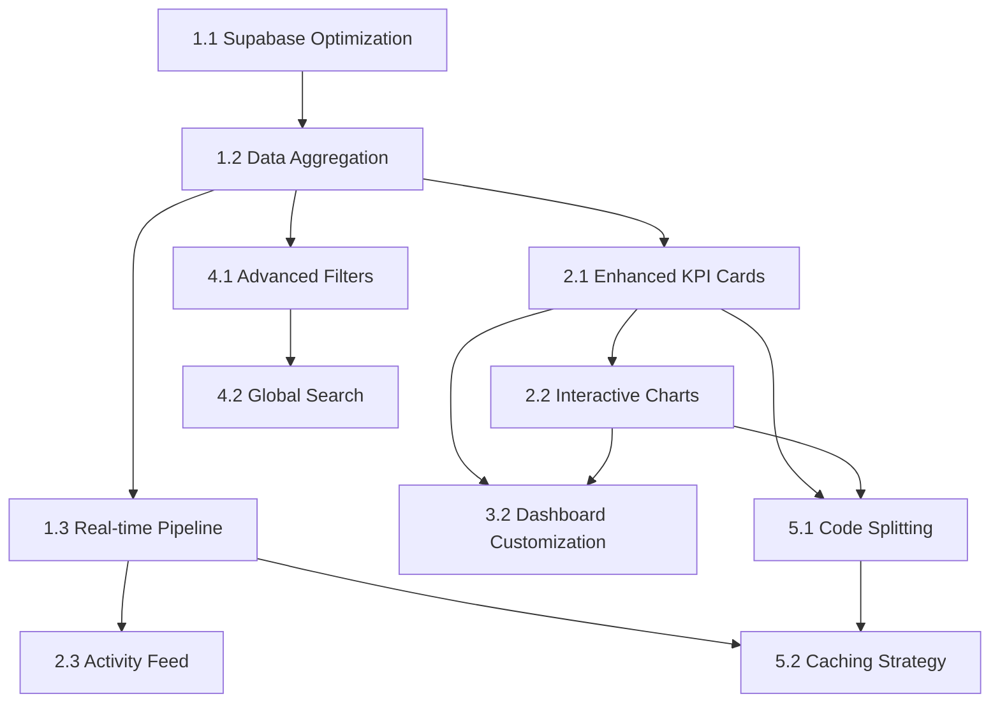

# Dashboard Enhancement Implementation Plan

## Overview
Transform the WSZ LLP dashboard into a comprehensive law practice management center with real-time data integration, enhanced navigation, and improved user experience.

## Major Tasks

### 1. Data Integration & Backend Enhancement
**Priority: High** | **Estimate: 8-12 hours**

- **Task 1.1**: Supabase Query Optimization
  - Create materialized views for dashboard metrics
  - Implement real-time subscriptions for live data
  - Add database indexes for performance
  - *Dependencies: None*

- **Task 1.2**: Data Aggregation Services
  - Build service layer for dashboard metrics calculation
  - Implement caching strategy for expensive queries
  - Add data validation and error handling
  - *Dependencies: 1.1*

- **Task 1.3**: Real-time Data Pipeline
  - Set up Supabase real-time subscriptions
  - Implement WebSocket connection management
  - Add connection retry logic and offline handling
  - *Dependencies: 1.1, 1.2*

### 2. Dashboard Component Architecture
**Priority: High** | **Estimate: 6-8 hours**

- **Task 2.1**: Enhanced KPI Cards System
  - Expand beyond current 4 cards to 8-12 metrics
  - Add trend indicators and percentage changes
  - Implement drill-down functionality
  - *Dependencies: 1.2*

- **Task 2.2**: Interactive Charts & Visualizations
  - Add Chart.js or Recharts for data visualization
  - Create revenue trends, case status charts
  - Implement responsive chart containers
  - *Dependencies: 2.1*

- **Task 2.3**: Activity Feed Component
  - Real-time updates for recent activities
  - Configurable activity types and filters
  - Pagination and infinite scroll
  - *Dependencies: 1.3*

### 3. Navigation & User Experience
**Priority: Medium** | **Estimate: 4-6 hours**

- **Task 3.1**: Enhanced Sidebar Navigation
  - Add dashboard quick-access shortcuts
  - Implement collapsible navigation groups
  - Add notification badges for pending items
  - *Dependencies: None*

- **Task 3.2**: Dashboard Customization
  - User-configurable widget layouts
  - Drag-and-drop dashboard organization
  - Personal dashboard preferences storage
  - *Dependencies: 2.1, 2.2*

- **Task 3.3**: Quick Action Toolbar
  - Add frequently used actions to dashboard
  - Implement keyboard shortcuts
  - Create context-aware action suggestions
  - *Dependencies: 3.1*

### 4. Filtering & Search Enhancement
**Priority: Medium** | **Estimate: 3-4 hours**

- **Task 4.1**: Advanced Filter System
  - Multi-criteria filtering across all data types
  - Saved filter presets
  - Filter combination logic (AND/OR)
  - *Dependencies: 1.2*

- **Task 4.2**: Global Search Integration
  - Cross-module search from dashboard
  - Search suggestions and autocomplete
  - Recent searches history
  - *Dependencies: 4.1*

### 5. Performance & Optimization
**Priority: Low** | **Estimate: 2-3 hours**

- **Task 5.1**: Code Splitting & Lazy Loading
  - Implement route-based code splitting
  - Lazy load dashboard components
  - Optimize bundle size for dashboard
  - *Dependencies: 2.1, 2.2*

- **Task 5.2**: Caching Strategy
  - Implement React Query for data caching
  - Add service worker for offline capability
  - Optimize re-render patterns
  - *Dependencies: 1.3, 5.1*

## Implementation Dependencies

## Next Actionable Steps

### Phase 1 (Week 1): Foundation
1. **Start with Task 1.1**: Set up Supabase materialized views for metrics
2. **Implement Task 1.2**: Create data aggregation service layer
3. **Begin Task 2.1**: Expand KPI cards system with new metrics

### Phase 2 (Week 2): Core Features
1. **Complete Task 1.3**: Real-time data pipeline implementation
2. **Implement Task 2.2**: Add interactive charts and visualizations
3. **Start Task 3.1**: Enhanced sidebar navigation

### Phase 3 (Week 3): Polish & Optimization
1. **Complete Task 2.3**: Activity feed component
2. **Implement Task 4.1**: Advanced filtering system
3. **Begin Task 5.1**: Performance optimizations

## Success Metrics
- Dashboard load time < 2 seconds
- Real-time updates within 500ms
- 95% user satisfaction with new navigation
- 40% reduction in clicks to reach common actions
EOF < /dev/null